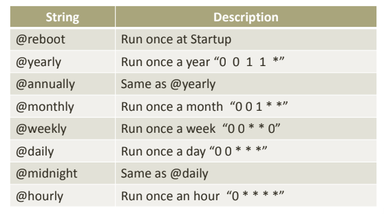
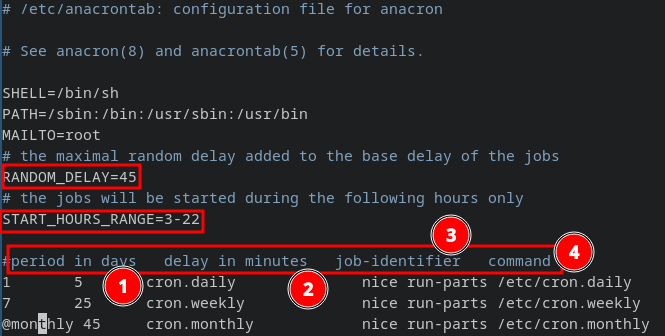

## Shell managed (Jobs)
- Foreground
- Background
## Daemon
=> background process that performs certain operations or provides services without direct user interaction.
=> Most daemons operate independently of a user session or terminal, so they keep running even if the user logs off.
some types of Daemons:
1. **System daemons manage critical services for the operating system:** 
	- `sshd`, `httpd`, `crond` for scheduled tasks. These daemons typically 
	- require _root_ privileges to access protected system resources and privileged network ports.

2. **Service daemons manage functions that are important to users or other applications**:
	- `mysqld`, `MySQL`, `docker`
	- start with _root_ privileges to configure the necessary environment, but then reduce their privileges to operate more safely.

3. **User daemons provide specific services for user sessions or personal features**.
	- `gvfsd` for virtual file system mounting, `pulseaudio` for audio management, and `dbus-daemon` for interprocess messaging. 
	- These daemons don’t require _root_ privileges, They operate within user sessions to ensure that their operations don’t interfere with those of other users on the system.

4. **kernel daemons operate at the kernel level and handle specific low-level system tasks**. Examples of these daemons include 
	- `ksoftirqd` for managing software interrupts
	- `kworker` for handling kernel background tasks, and 
	- `kswapd` for virtual memory management. 
	- run in kernel space, which means they have full access to system resources and can perform critical operations without being subject to regular user privileges.

#### **Managing Daemons:** `systemctl`
- check service status: `systemctl status service_name`
- start service `systemctl start service_name`
- stop service `systemctl stop service_name`
- restart service: `systemctl restart service_name`
- reload service: `systemctl reload service_name`
- enable service: `systemctl enable service_name`
- disable service: `systemctl disable service_name.service`
- list all current active units: `systemctl list-units`
	- `-all` for all active and inactive

## Scheduled Tasks
### Time-Based Scheduling
#### at
=> the `at` command in Linux provides a solution for scheduling efficiently, using the `atd` service for job management.

**Syntax :**`at [-q queue] [-f file] [-t] TIME  `
- **Options**

| option | usage                  | example                         |
| ------ | ---------------------- | ------------------------------- |
| -f     | specify script file    | `at -f script now + 1 day`      |
| -q     | specify the queue name | `at -q a -f script now + 1 day` |
| -r     | remove task            | `at -r <JobId>`                 |
| -l     | list all jobs          | `at -l`                         |


**How to write time:**
- `-t` option: syntax `YYYYMMDDHHMM` :  `at -f script -t 202511121540`
- by using time keywords : `at -f script -t now + 1 minutes
	- `now` 
	- `now + 1 (minutes,day,month,year)`
	- `next sunday`

**Service used:**
`atd`: 
- daemons service, which runs in the background and manages the execution of these scheduled jobs. 
- it periodically check the spool directory and read all tasks, if the time has arrived then execute it

=> jobs stored in `/var/spool/at`
#### batch
=> Run the task when the system resources allow
**Syntax:** `batch < scriptFile`

#### **Cron Job**
- scheduled jobs run periodically
- run at
	- fixed time
	- fixed date
	- fixed interval
- if device was off at the job time, cron will simply **skip** it.
- saved in file called `crontab`: a cron job is an entry written into a table called the _cron table_
- **crond:** daemon service that responsible to read cron table 

> cron table entries

```
# Example of job definition:
# .---------------- minute (0 - 59)
# |  .------------- hour (0 - 23)
# |  |  .---------- day of month (1 - 31)
# |  |  |  .------- month (1 - 12) OR jan,feb,mar,apr ...
# |  |  |  |  .---- day of week (0 - 6) (Sunday=0 or 7) OR sun,mon,tue,wed,thu,fri,sat
# |  |  |  |  |
# *  *  *  *  * user-name command to be executed
```


- `crontabe -e`: create or edit a cron job a
	- it will open a temp file to write the job entry then when save it, it will write the entry at `/var/spool/cron/user`
	- `crontab -u user - e` to add cron for another user

#### `anacron`
-> does not assume that the machine is running continuously. Hence, it can be used on machines that aren't running 24 hours a day, to control regular jobs as daily, weekly, and monthly jobs.
-> For each job, `Anacron` checks whether this job has been executed in the last n days, where n is the period specified for that job. If not, `Anacron` runs the job's shell command.



### Event-Based Scheduling
=> run background jobs in response to specific _events_, such as file creation. example, when:
- startup/ shutdown
- file system event (change, create, delete)
- internet event
- hardware event
- custom signal
#### Inotify
-> monitor file system events

**`inotifywait`** 
-> a tool to monitor files and directories
**syntax:** `inotifywait [options] directory_or_file `

| options | function      |
| ------- | ------------- |
| -r      | recursive     |
| -m      | monitor       |
| -e      | specify event |

| **Event**       | **What It Actually Means**                                                                                   |
| --------------- | ------------------------------------------------------------------------------------------------------------ |
| `create`        | A file or directory was created _inside_ the watched directory.                                              |
| `delete`        | A file or directory was deleted _from_ the watched directory.                                                |
| `modify`        | A file was written to. (You'll get a _lot_ of these.)                                                        |
| `close_write`   | **A key one.** A file that was opened for writing is now closed. This is often your "save complete" trigger. |
| `close_nowrite` | A file that was opened read-only was closed.                                                                 |
| `move`          | A file or directory was opened.                                                                              |
| `close`         | Metadata changed. (e.g., `chmod` or `chown`)                                                                 |
| `moved_from`    | A file was moved _out_ of the watched directory.                                                             |
| `moved_to`      | A file was moved _into_ the watched directory.                                                               |


---

**Resources:**
- [Course102: Understanding Linux - YouTube](https://youtube.com/playlist?list=PLWXRxAK4bUzc9gq-W2xWDe9zEaDcowLfs&si=ndOEzHUnnyegm0im)
- [What Is a Daemon in Linux? \| Baeldung on Linux](https://www.baeldung.com/linux/daemon-guide)
- [Cron Jobs: The Complete Guide for 2025](https://cronitor.io/guides/cron-jobs)
- [inotify(7) - Linux manual page](https://man7.org/linux/man-pages/man7/inotify.7.html)
- [at Command - IBM Documentation](https://www.ibm.com/docs/en/aix/7.1.0?topic=command) 
- check cron syntax : [Crontab.guru - The cron schedule expression generator](https://crontab.guru/#@)
- [BeRoot/Job Scheduling at main · SalmaAlassal/BeRoot · GitHub](https://github.com/SalmaAlassal/BeRoot/tree/main/Job%20Scheduling) 
